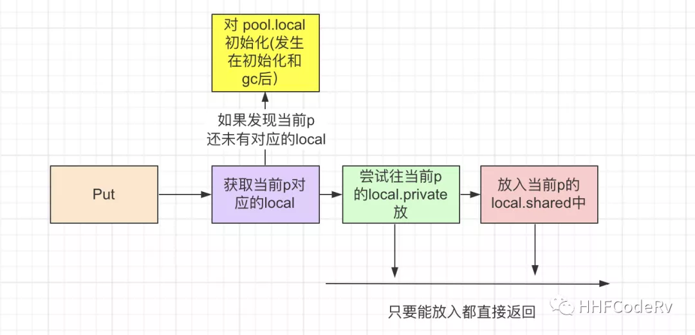

## sync.Pool

sync.Pool 是一个协程安全的内存池。主要用于增加临时对象的内存复用率，减少内存分配和 GC STW 的开销。

### 1. 使用方式

**节选自 gin 的例子：**

```go
func (engine *Engine) ServeHTTP(w http.ResponseWriter, req *http.Request) {
    c := engine.pool.Get().(*Context)
    c.writermem.reset(w)
    c.Request = req
    c.reset()
  
    engine.handleHTTPRequest(c)
  
    engine.pool.Put(c)
}
```

- `Get` 方法会获取一个 Pool 已经存在的对象，如果没有，那么就调用初始化时定义的 New 方法来初始化一个对象。

- `Put` 方法会把对象放回池子。调用之后仅把这个对象放回池子，池子里面的**对象什么时候真正释放不受外部控制**。

### 2. 重点

1. sync.Pool 是线程安全的，但 Pool.New 不是线程安全的，此函数可能被并发调用；
2. sync.Pool 不能被复制；
3. sync.Pool 内部元素的回收被 GC 影响，不适合于做连接池，因为连接池需要自己管理对象的生命周期；
4. 不要对 Get 得到的对象有任何假设，更好的做法是归还对象时，将对象**清空**；
5. sync.Pool 不可以指定⼤⼩，⼤⼩只受制于 GC 临界值；
6. 在加入 `victim` 机制前，sync.Pool 里对象的最⼤缓存时间是一个 GC 周期，当 GC 开始时，没有被引⽤的对象都会被清理掉。加入 `victim` 机制后，最大缓存时间为两个 GC 周期；
7. sync.Pool 的最底层使用切片加链表来实现双端队列，并将缓存的对象存储在切片中。

### 3. 数据结构

以下是 sync.Pool 的整体结构：


**`local`**

sync.Pool 的 local 是一个切片，存储了多个 `poolLocal` 对象，每个 P 都有一个专属的 poolLocal，这样可以使 P 在执行时基本只需要访问自己拥有的 poolLocal。

**`poolLocalInternal`**

每个 poolLocal 内部都有一个 **private **和 **shared**。

- private 区只存放一个对象，因为每个 P 同时执行的 G 只有一个，所以在 private 写入和取出对象是不需要加锁的。
- shared 区是一个双端链表，存放了多个对象，此区域的对象可以被其他 P 获取到。

**`poolChain`**

在 go1.13 优化过后，`poolChain` 不再使用加锁的切片，而是使用双向链表，每个链表节点指向一个无锁环形队列。

此数据结构逻辑为单生产者，多消费者。

- 只能由所属的 P 进行生产，并只能放在队列的头部。由于每个 P 任意时刻只有一个 G 被运行，所以存放对象不需要加锁。
- 消费可以由所有的 P 进行消费。
  - 由所属的 P 来 Get 时，从队列头部取，也不需要加锁，理由同上。
  - 由其他 P 来 Get 时，只能从队列尾部取，由于其他 P 可能有多个，所以使用 CAS 来实现无锁。

### 4. 执行流程

**Pool.Get 执行流程：**


**Pool.Put 执行流程：**



### 5. victim 机制

在 `golang 1.13` 版本中，新增了 victim 机制来优化 sync.Pool 的性能。

在旧版本中，每次 GC 都会将 Pool 中所有闲置的对象全部回收。此时如果存在大量的闲置对象，那么 GC 的 STW 压力会骤然变大，消耗的时间也会变长，重新 New 创建对象的消耗也会变大。

victim 机制，则是在 GC 时，将 `local` 中的所有对象移动到 `victim` 中，在下一次 GC 时，再删除掉 victim 中的元素，并又一次将 local 中的对象移动到 victim 中。

以下是新版的 **Pool GC 执行流程：**


在此过程中，`Get` 如果在 local 中找不到对象，会去 victim 中查找，Put 会将取出的对象重新放回 local 中。

此机制使得 sync.Pool 中闲置对象的最大缓存时间，从一个 GC 周期变成了两个 GC 周期。