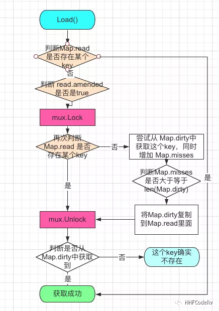
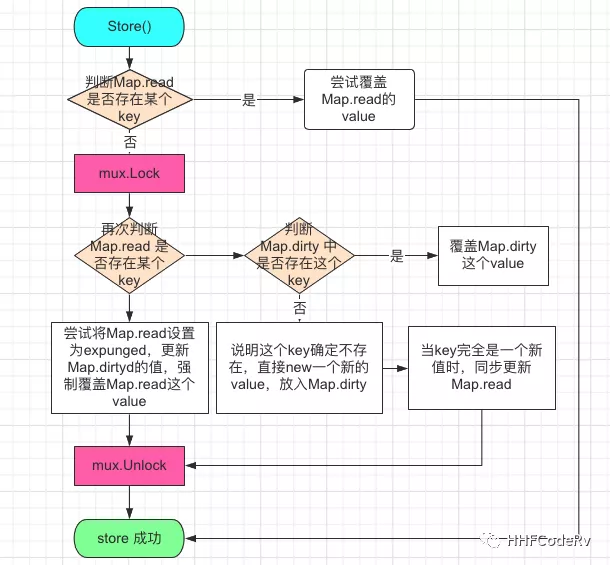
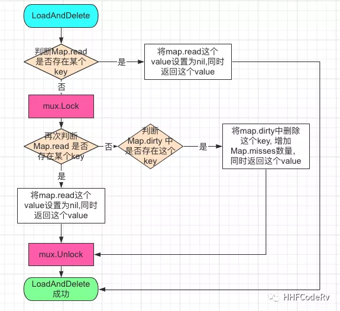
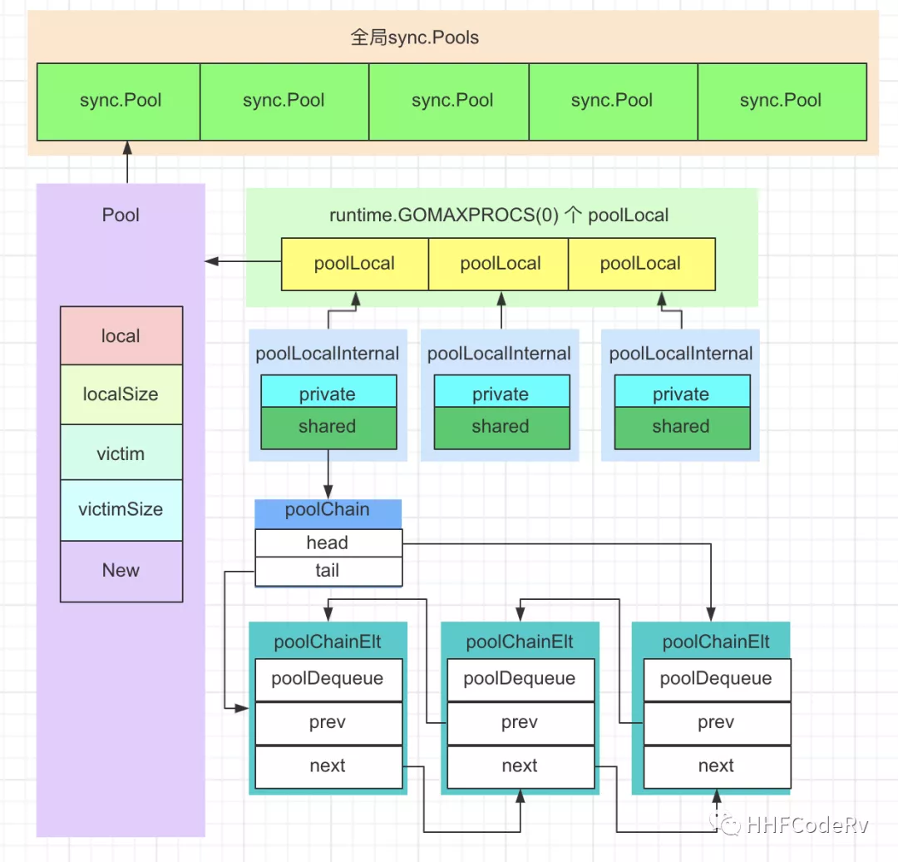
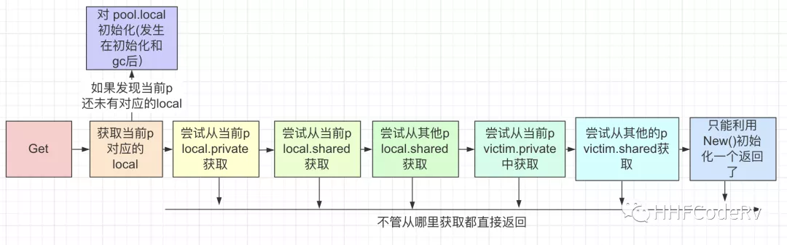
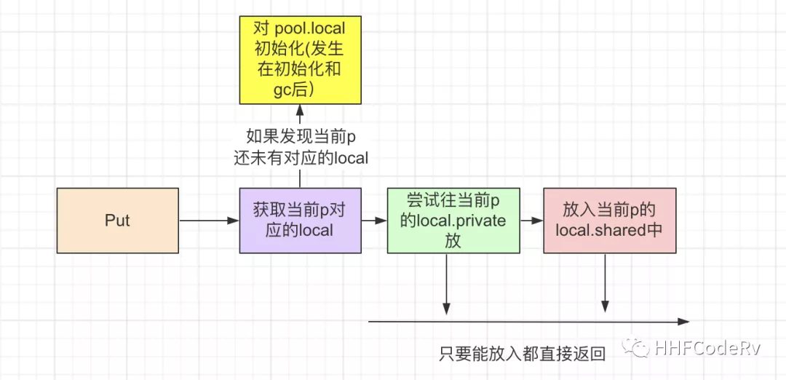
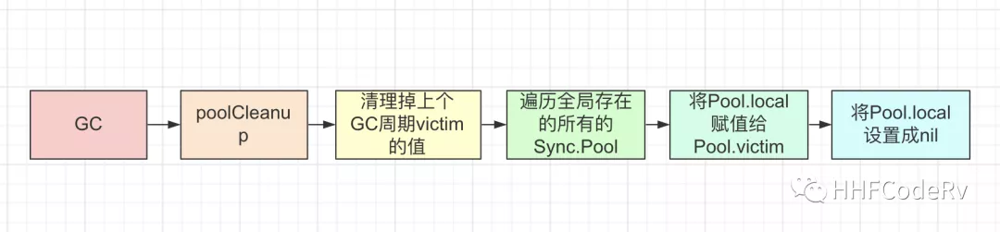
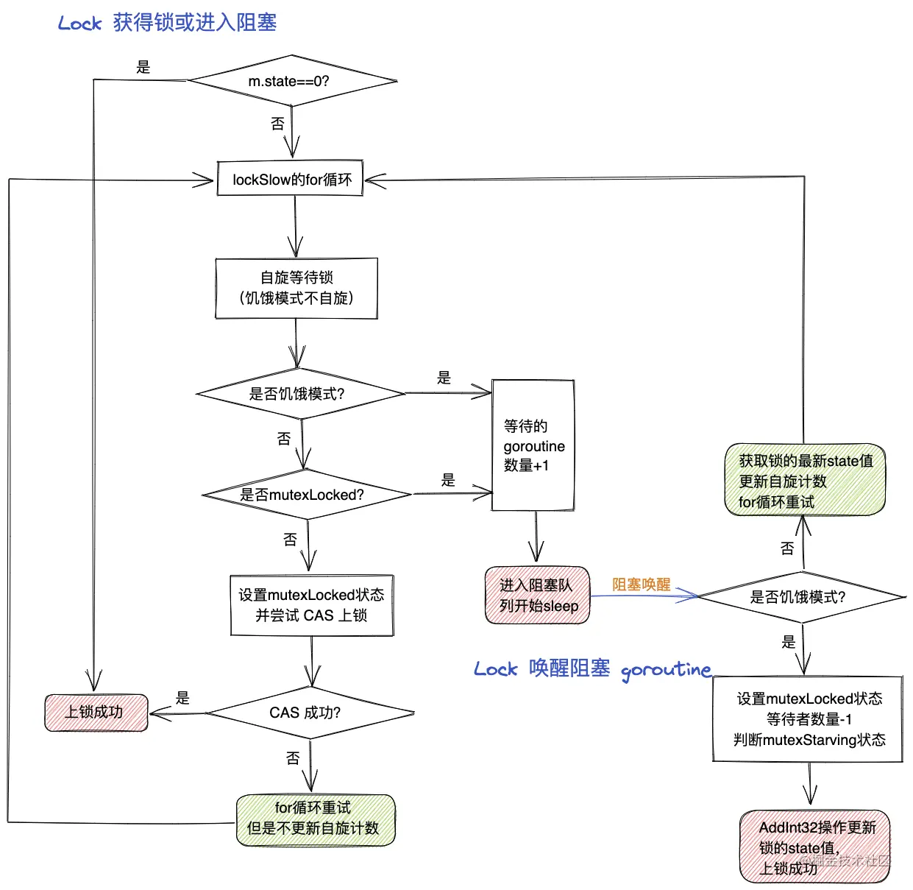
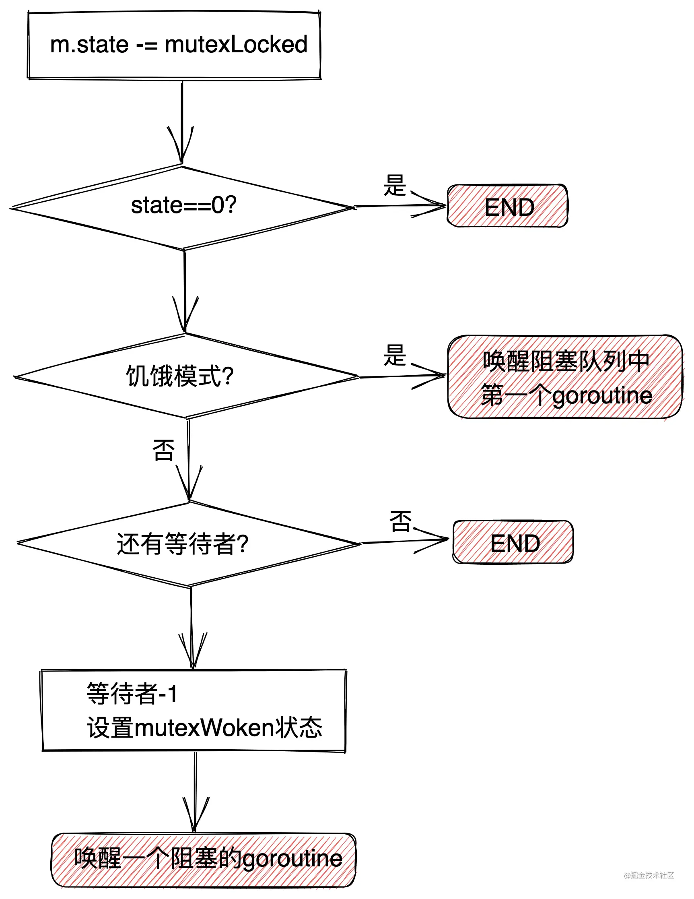

# sync

sync 是 golang 的标准库，专门用于提供并发功能的各种组件，包括锁、Map、Pool、WaitGroup 等等。

## sync.Map

`sync.Map` 是标准库 `sync` 中实现的并发安全的 map。

### 1. 使用方式

| 操作             | 普通 map       | sync.Map          |
| :--------------- | :------------- | :---------------- |
| map 获取某个 key | map[1]         | sync.Load(1)      |
| map 添加元素     | map[1] = 10    | sync.Store(1, 10) |
| map 删除一个 key | delete(map, 1) | sync.Delete(1)    |
| 遍历 map         | for...range    | sync.Range()      |

sync.Map 两个特有的函数:

- `LoadOrStore` - sync.Map 存在就返回，不存在就插入
- `LoadAndDelet` - sync.Map 获取某个 key，如果存在的话，同时删除这个 key

**例子：**

```go
var syncMap sync.Map
syncMap.Store("11", 11)
syncMap.Store("22", 22)

fmt.Println(syncMap.Load("11")) // 11
fmt.Println(syncMap.Load("33")) // 空

fmt.Println(syncMap.LoadOrStore("33", 33)) // 33
fmt.Println(syncMap.Load("33")) // 33
fmt.Println(syncMap.LoadAndDelete("33")) // 33
fmt.Println(syncMap.Load("33")) // 空

syncMap.Range(func(key, value interface{}) bool {
  fmt.Printf("key:%v value:%v\n", key, value)
  return true
})
```

### 2. 数据结构

```go
type Map struct {
 mu Mutex
 read atomic.Value // readOnly  read map
 dirty map[interface{}]*entry  // dirty map
 misses int
}
```

**`read`**

是 `atomic.Value` 类型，主要负责并发读取。使用 lock free 的方式保证 load/store 的原子性。

- 如果需要更新 `read`，则需要加锁保护。对于 read 中存储的 entry 字段，可能会被并发地 CAS 更新。
- 如果要更新一个之前已被删除的 entry，则需要先将其状态从 expunged 改为 nil，再拷贝到 dirty 中，然后再更新。


**`dirty`**

是一个非线程安全的原始 map。使用 `mutex` 保证并发安全。

dirty 包含新写入的 key，并且包含 `read` 中的所有未被删除的 key。这样，可以快速地将 `dirty` 提升为 `read` 对外提供服务。

如果 `dirty` 为 nil，那么下一次写入时，会新建一个新的 `dirty`，这个初始的 `dirty` 是 `read` 的一个拷贝，但除掉了其中已被删除的 key。

- 当 dirty 为 nil 的时候，read 就代表 map 所有的数据。
- 当 dirty 不为 nil 的时候，dirty 代表 map 所有的数据。


**`misses`**

用于记录未命中 read 缓存的次数。

- 每次在 read 中没找到数据，而在 dirty 中找到，则这个数字加 1。
- 当 misses 大于 dirty 的数量时，会将 dirty 的数据整体复制到 read，并清空 dirty，此操作时间复杂度为 O(N)。

### 3. 使用场景

sync.Map 里面有两个普通 map，read map 主要负责读，dirty map 负责读和写（加锁）。

在读多写少的场景下，read map 的值基本不发生变化，可以让 read map 做到无锁操作，就减少了使用 `Mutex + Map` 必须的加锁/解锁环节，因此也就提高了性能。

如果某些 key 写操作特别频繁，sync.Map 基本就退化成了 `Mutex + Map`，甚至有可能性能不如 Mutex + Map。

所以 sync.Map 适用于以下场景：

- 读多写少
- 写操作多，但是修改的 key 和读取的 key 特别不重合。

### 4. 执行流程

**sync.Map.Load() 取出对象流程：**



**sync.Map.Store() 插入对象流程：**



**sync.Map.LoadAndDelete() 删除对象流程：**



## sync.Pool

sync.Pool 是一个协程安全的内存池。主要用于增加临时对象的内存复用率，减少内存分配和 GC STW 的开销。

### 1. 使用方式

**节选自 gin 的例子：**

```go
func (engine *Engine) ServeHTTP(w http.ResponseWriter, req *http.Request) {
    c := engine.pool.Get().(*Context)
    c.writermem.reset(w)
    c.Request = req
    c.reset()
  
    engine.handleHTTPRequest(c)
  
    engine.pool.Put(c)
}
```

- `Get` 方法会获取一个 Pool 已经存在的对象，如果没有，那么就调用初始化时定义的 New 方法来初始化一个对象。

- `Put` 方法会把对象放回池子。调用之后仅把这个对象放回池子，池子里面的**对象什么时候真正释放不受外部控制**。

### 2. 重点

1. sync.Pool 是线程安全的，但 Pool.New 不是线程安全的，此函数可能被并发调用；
2. sync.Pool 不能被复制；
3. sync.Pool 内部元素的回收被 GC 影响，不适合于做连接池，因为连接池需要自己管理对象的生命周期；
4. 不要对 Get 得到的对象有任何假设，更好的做法是归还对象时，将对象**清空**；
5. sync.Pool 不可以指定⼤⼩，⼤⼩只受制于 GC 临界值；
6. 在加入 `victim` 机制前，sync.Pool 里对象的最⼤缓存时间是一个 GC 周期，当 GC 开始时，没有被引⽤的对象都会被清理掉。加入 `victim` 机制后，最大缓存时间为两个 GC 周期；
7. sync.Pool 的最底层使用切片加链表来实现双端队列，并将缓存的对象存储在切片中。

### 3. 数据结构

以下是 sync.Pool 的整体结构：



**`local`**

sync.Pool 的 local 是一个切片，存储了多个 `poolLocal` 对象，每个 P 都有一个专属的 poolLocal，这样可以使 P 在执行时基本只需要访问自己拥有的 poolLocal。

**`poolLocalInternal`**

每个 poolLocal 内部都有一个 **private **和 **shared**。

- private 区只存放一个对象，因为每个 P 同时执行的 G 只有一个，所以在 private 写入和取出对象是不需要加锁的。
- shared 区是一个双端链表，存放了多个对象，此区域的对象可以被其他 P 获取到。

**`poolChain`**

在 go1.13 优化过后，`poolChain` 不再使用加锁的切片，而是使用双向链表，每个链表节点指向一个无锁环形队列。

此数据结构逻辑为单生产者，多消费者。

- 只能由所属的 P 进行生产，并只能放在队列的头部。由于每个 P 任意时刻只有一个 G 被运行，所以存放对象不需要加锁。
- 消费可以由所有的 P 进行消费。
  - 由所属的 P 来 Get 时，从队列头部取，也不需要加锁，理由同上。
  - 由其他 P 来 Get 时，只能从队列尾部取，由于其他 P 可能有多个，所以使用 CAS 来实现无锁。

### 4. 执行流程

**Pool.Get 执行流程：**



**Pool.Put 执行流程：**



### 5. victim 机制

在 `golang 1.13` 版本中，新增了 victim 机制来优化 sync.Pool 的性能。

在旧版本中，每次 GC 都会将 Pool 中所有闲置的对象全部回收。此时如果存在大量的闲置对象，那么 GC 的 STW 压力会骤然变大，消耗的时间也会变长，重新 New 创建对象的消耗也会变大。

victim 机制，则是在 GC 时，将 `local` 中的所有对象移动到 `victim` 中，在下一次 GC 时，再删除掉 victim 中的元素，并又一次将 local 中的对象移动到 victim 中。

以下是新版的 **Pool GC 执行流程：**



在此过程中，`Get` 如果在 local 中找不到对象，会去 victim 中查找，Put 会将取出的对象重新放回 local 中。

此机制使得 sync.Pool 中闲置对象的最大缓存时间，从一个 GC 周期变成了两个 GC 周期。

## sync.WaitGroup

## sync.Mutex

`sync.Mutex` 是一个互斥锁，默认为零值时为开锁状态。

### 1. 使用方式

Lock 方法锁住 m，如果 m 已经加锁，则阻塞直到 m 解锁。

```go
func (m *Mutex) Lock()
```

Unlock 方法解锁 m，如果 m 未加锁会导致运行时错误。

```go
func (m *Mutex) Unlock()
```

### 2. 数据结构

```go
type Mutex struct {
    state int32
    sema  uint32
}
const (
   mutexLocked = 1 << iota // mutex is locked
   mutexWoken
   mutexStarving
   mutexWaiterShift = iota
)
```

- **`state`**

  是一个公用字段，共 32 位。其中低三位分别表示：

  - Mutex 是否已被加锁
  - 是否有某个唤醒的 G 要尝试获取锁
  - Mutex 是否处于饥饿状态

  高 29 位则表示等待锁的 G 数量。

- **`sema`**

  sema 是一个信号量，用来实现阻塞/唤醒申请锁的 G。

### 3. 执行流程

**Mutex Lock 上锁流程：**

- 非饥饿模式下，新获取锁的 G 将会进入自旋，去竞争锁。为了避免自旋消耗太多 cpu，G 最多会自旋 4 次,每次空转 30 个 cpu 时钟周期；



**Mutex UnLock 解锁流程：**



### 4. 饥饿状态

互斥锁有两种状态：正常状态和饥饿状态。

**正常状态：**

所有等待锁的 G 按照 FIFO 顺序等待。

- 刚唤醒的 G 不会直接拥有锁，而是会和新请求锁的 G 去竞争锁；
- 新请求锁的 G 具有一个优势：它正在 CPU 上执行；
- 可能有好几个 G 同时在新请求锁，所以刚唤醒的 G 有很大可能在锁竞争中失败；
- 在这种情况下，这个被唤醒的 G 在没有获得锁之后会加入到等待队列的最前面。

**饥饿状态：**

如果一个等待的 G 超过 `1ms` 没有获取锁，那么它将会把锁转变为饥饿模式。

- 饥饿模式下，锁的所有权将从执行 unlock 的 G 直接交给等待队列中的第一个 G;
- 新来的 G 将不能再去尝试竞争锁，即使锁是 unlock 状态，也不会去尝试自旋操作，而是放在等待队列的尾部;
- 如果一个等待的 G 获取了锁，并且满足以下其中一个条件,那么该 G 会将锁的状态转换为正常状态:
  1. 它是队列中的最后一个 G；
  2. 它等待的时间小于 1ms；

**总结：**

正常模式具有较好的性能，因为 G 可以连续多次尝试获取锁，即使还有其他的阻塞等待锁的 G，也不需要进入休眠阻塞。

饥饿模式的作用是阻止尾部延迟的现象。

### 5. 总结

1. Mutex 不可被复制；
2. 就算在较低 QPS 下，Mutex 的锁竞争也会比较激烈。如果一定要使用 Mutex，一定要采用取模分片的方式去使用其中一个 Mutex 进行资源控制，降低锁粒度；
3. 不同 G 可以 Unlock 同一个 Mutex，但是 Unlock 一个无锁状态的 Mutex 会报错；
4. Mutex 不是可重入锁，如果连续两次 Lock 操作，会直接死锁。

## sync.RWMutex

`sync.RWMutex` 是一个读写锁，在读多写少的场景中，比 Mutex 的并发能力有很大的提升。

### 1. 使用方式

读写锁的读锁与写锁、写锁与写锁互斥，读锁与读锁之间互不影响。

```go
func (rw *RWMutex) Lock         // 写锁加锁
func (rw *RWMutex) Unlock       // 写锁解锁
func (rw *RWMutex) RLock        // 读锁加锁
func (rw *RWMutex) RUnlock      // 读锁解锁
```

### 2. 数据结构

```go
type RWMutex struct {
	w           Mutex  // held if there are pending writers
	writerSem   uint32 // semaphore for writers to wait for completing readers
	readerSem   uint32 // semaphore for readers to wait for completing writers
	readerCount int32  // number of pending readers
	readerWait  int32  // number of departing readers
}
```

**`w`** - 用互斥锁解决多个 writer 的竞争。

- 当有 G 获取写锁后，会阻塞其他 G 的写操作。

**`writerSem`** - 写操作的信号量。

**`readerSem`** - 读操作的信号量。

**`readerCount`** - 当前读操作的数量，以及是否有写操作在等待。

- 每一次获取读锁，都会将此数量加 1，如果此数量为负数，说明有 G 获取了写锁，当前 G 会陷入休眠等锁释放。
- 每一次释放读锁，都会将此数量减 1。
- 获取写锁时，会阻塞后续的读操作，并休眠等待当前正在进行的读操作执行完毕。
- 释放写锁时，会将此数量变回正数，释放读锁。

**`readerWait`** - 写操作请求锁时，需要等待完成的读操作数量。

### 3. 总结

读写互斥锁在互斥锁之上提供了额外的更细粒度的控制，能够在读操作远远多于写操作时提升性能。
