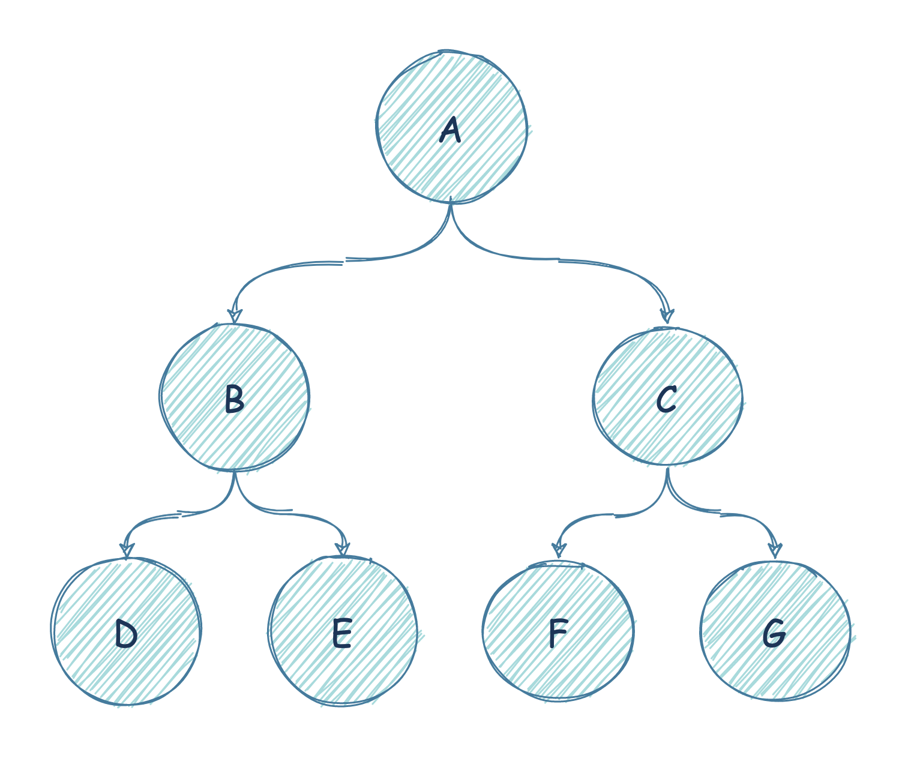
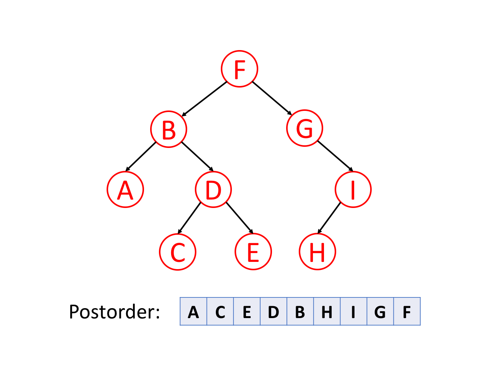

# 二叉树

树是一种经常用到的数据结构，用来模拟具有树状结构性质的数据集合。树里的每一个节点有一个值和一个包含所有子节点的列表。

从图的观点来看，树也可视为一个拥有 N 个节点和 N-1 条边的一个有向无环图。

二叉树是一种典型的树状结构，是每个节点最多有两个子树的树结构，通常子树被称作左子树和右子树。



## 概念

### 1. 完美二叉树

`Perfect Binary Tree`，国内也称满二叉树。指二叉树所有叶子节点都在同一层，每个父节点都有两个子节点。

如果完美二叉树的层数为 K，则节点总数为 $k^2 - 1$。


### 2. 完全二叉树

`Complete Binary Tree`，指每一层节点都紧凑靠左排列。

如果完全二叉树的层数为 K，则：

- 除第 K 层外，其他所有层的节点都是满的。
- 第 K 层所有节点都连续集中在左边。


### 3. Full binary tree

`Full binary tree` 所有节点，要么两个子节点都存在，要么两个子节点都不存在。


## 深度优先搜索

这是递归遍历二叉树的三种方式：

```go
// 二叉树遍历框架
func traverse(root *Node) {
    // 前序遍历
    traverse(root.Left)
    // 中序遍历
    traverse(root.Right)
    // 后序遍历
}
```

- `快速排序`就是个二叉树的前序遍历

- `归并排序`就是个二叉树的后序遍历

### 1. 前序遍历

前序遍历首先访问根节点，然后遍历左子树，最后遍历右子树。


### 2. 中序遍历

中序遍历是先遍历左子树，然后访问根节点，然后遍历右子树。


### 3. 后序遍历

后序遍历是先遍历左子树，然后遍历右子树，最后访问树的根节点。



## 二叉树题解

### 105. 从前序与中序遍历序列构造二叉树

Leetcode 题目描述: [从前序与中序遍历序列构造二叉树](https://leetcode-cn.com/problems/construct-binary-tree-from-preorder-and-inorder-traversal/)

给定一棵树的前序遍历 `preorder` 与中序遍历 `inorder`。请构造二叉树并返回其根节点。

**注意:** 可以假设树中没有重复的元素。

```go
func buildTree(preorder []int, inorder []int) *TreeNode {
	if len(preorder) == 0 || len(inorder) == 0 {
		return nil
	}

	n := new(TreeNode)
	n.Val = preorder[0]

	var rootIndex int

	for i, v := range inorder {
		if v == preorder[0] {
			rootIndex = i
			break
		}
	}

	n.Left = buildTree(preorder[1:rootIndex+1], inorder[:rootIndex])
	n.Right = buildTree(preorder[rootIndex+1:], inorder[rootIndex+1:])
	return n
}
```

### 106. 从中序与后序遍历序列构造二叉树

Leetcode 题目描述: [从中序与后序遍历序列构造二叉树](https://leetcode-cn.com/problems/construct-binary-tree-from-inorder-and-postorder-traversal/)

根据一棵树的中序遍历与后序遍历构造二叉树。

**注意:** 可以假设树中没有重复的元素。

```go
func buildTree(inorder []int, postorder []int) *TreeNode {
	if len(inorder) == 0 || len(postorder) == 0 {
		return nil
	}

	n := new(TreeNode)
	n.Val = postorder[len(postorder)-1]

	var rootIndex int

	for i, v := range inorder {
		if v == n.Val {
			rootIndex = i
			break
		}
	}

	n.Left = buildTree(inorder[:rootIndex], postorder[:rootIndex])
	n.Right = buildTree(inorder[rootIndex+1:], postorder[rootIndex:len(postorder)-1])
	return n
}
```

### 114. 二叉树展开为链表

Leetcode 题目描述: [二叉树展开为链表](https://leetcode-cn.com/problems/flatten-binary-tree-to-linked-list/)

给你二叉树的根结点 root，将它展开为一个单链表：

- 展开后的单链表应该同样使用 TreeNode，其中 right 子指针指向链表中下一个结点，而左子指针始终为 null。
- 展开后的单链表应该与二叉树`先序遍历`顺序相同。

```go
func flatten(root *TreeNode) {
	if root == nil {
		return
	}

	flatten(root.Left)
	flatten(root.Right)

	tmp := root.Right
	root.Right = root.Left
	root.Left = nil

	p := root
	for p.Right != nil {
		p = p.Right
	}
	p.Right = tmp
}
```

### 116. 填充每个节点的下一个右侧节点指针

Leetcode 题目描述: [填充每个节点的下一个右侧节点指针](https://leetcode-cn.com/problems/populating-next-right-pointers-in-each-node/)

给定一个`完美二叉树`，其所有叶子节点都在同一层，每个父节点都有两个子节点。

二叉树定义如下：

```go
struct Node {
  int val;
  Node *left;
  Node *right;
  Node *next;
}
```

填充它的每个 next 指针，让这个指针指向其下一个右侧节点。如果找不到下一个右侧节点，则将 next 指针设置为 NULL。

初始状态下，所有 next 指针都被设置为 NULL。

```go
func connect(root *Node) *Node {
	if root == nil {
		return nil
	}

	for top := root; top.Left != nil; top = top.Left {
		for node := top; node != nil; node = node.Next {
			node.Left.Next = node.Right
			if node.Next != nil {
				node.Right.Next = node.Next.Left
			}
		}
	}

	return root
}
```

### 226. 翻转二叉树

Leetcode 题目描述: [翻转二叉树](https://leetcode-cn.com/problems/invert-binary-tree/)

翻转一棵二叉树。

```go
func invertTree(root *TreeNode) *TreeNode {
	invert(root)
	return root
}

func invert(n *TreeNode) {
	if n == nil {
		return
	}
	n.Left, n.Right = n.Right, n.Left
	invert(n.Left)
	invert(n.Right)
}
```

### 236. 二叉树的最近公共祖先

Leetcode 题目描述: [二叉树的最近公共祖先](https://leetcode-cn.com/problems/lowest-common-ancestor-of-a-binary-tree/)

给定一个二叉树, 找到该树中两个指定节点的最近公共祖先。

- 一个节点可以是它自己的祖先。

```go
func lowestCommonAncestor(root, p, q *TreeNode) *TreeNode {
	if root == nil {
		return nil
	}
	if root.Val == p.Val || root.Val == q.Val {
		return root
	}

	left := lowestCommonAncestor(root.Left, p, q)
	right := lowestCommonAncestor(root.Right, p, q)
	switch {
	case left != nil && right != nil:
		return root
	case left == nil && right == nil:
		return nil
	case left != nil:
		return left
	case right != nil:
		return right
	}
	return nil
}
```

### 297. 二叉树的序列化与反序列化

Leetcode 题目描述: [二叉树的序列化与反序列化](https://leetcode-cn.com/problems/serialize-and-deserialize-binary-tree/)

序列化是将一个数据结构或者对象转换为连续的比特位的操作，进而可以将转换后的数据存储在一个文件或者内存中，同时也可以通过网络传输到另一个计算机环境，采取相反方式重构得到原数据。

请设计一个算法来实现二叉树的序列化与反序列化。这里不限定你的序列/反序列化算法执行逻辑，你只需要保证一个二叉树可以被序列化为一个字符串并且将这个字符串反序列化为原始的树结构。

```go
import (
	"strconv"
	"strings"
)

type Codec struct{}

func Constructor() Codec {
	return Codec{}
}

// Serializes a tree to a single string.
func (this *Codec) serialize(root *TreeNode) string {
	builder := &strings.Builder{}

	var serl func(n *TreeNode)
	serl = func(n *TreeNode) {
		if n == nil {
			builder.WriteString("null,")
			return
		}

		builder.WriteString(strconv.Itoa(n.Val))
		builder.WriteString(",")
		serl(n.Left)
		serl(n.Right)
	}
	serl(root)

	return builder.String()
}

// Deserializes your encoded data to tree.
func (this *Codec) deserialize(data string) *TreeNode {
	d := strings.Split(data, ",")
	return deserl(&d)
}

func deserl(data *[]string) *TreeNode {
	nodeV := (*data)[0]
	*data = (*data)[1:]

	if nodeV == "null" {
		return nil
	}

	v, _ := strconv.Atoi(nodeV)
	n := &TreeNode{Val: v}
	n.Left = deserl(data)
	n.Right = deserl(data)
	return n
}
```

### 652. 寻找二叉树重复的子树

Leetcode 题目描述: [寻找二叉树重复的子树](https://leetcode-cn.com/problems/find-duplicate-subtrees/)

给定一棵二叉树，返回所有重复的子树。对于同一类的重复子树，你只需要返回其中任意一棵的根结点即可。

两棵树重复是指它们具有相同的结构以及相同的结点值。

```go
func findDuplicateSubtrees(root *TreeNode) []*TreeNode {
	nodes := make([]*TreeNode, 0)
	count := make(map[string]int, 0)

	var dfs func(node *TreeNode) string
	dfs = func(node *TreeNode) string {
		if node == nil {
			return ""
		}

		strBuilder := &strings.Builder{}
		strBuilder.WriteString(strconv.Itoa(node.Val))
		strBuilder.WriteString(",")
		strBuilder.WriteString(dfs(node.Left))
		strBuilder.WriteString(",")
		strBuilder.WriteString(dfs(node.Right))
		s := strBuilder.String()

		if v, ok := count[s]; ok {
			if v == 1 {
				nodes = append(nodes, node)
			}
		}
		count[s] += 1
		return s
	}
	dfs(root)
	return nodes
}
```

### 654. 最大二叉树

Leetcode: [最大二叉树](https://leetcode-cn.com/problems/maximum-binary-tree/)

给定一个不含重复元素的整数数组 `nums` 。一个以此数组直接递归构建的`最大二叉树`定义如下：

1. 二叉树的根是数组 nums 中的最大元素。
2. 左子树是通过数组中 最大值左边部分 递归构造出的最大二叉树。
3. 右子树是通过数组中 最大值右边部分 递归构造出的最大二叉树。

返回有给定数组 nums 构建的 最大二叉树 。

```go
func constructMaximumBinaryTree(nums []int) *TreeNode {
	if len(nums) == 0 {
		return nil
	}

	node := new(TreeNode)

	if len(nums) == 1 {
		node.Val = nums[0]
		return node
	}

	var index, nodeVal int
	for i, v := range nums {
		if v > nodeVal {
			index = i
			nodeVal = v
		}
	}

	node.Val = nodeVal
	node.Left = constructMaximumBinaryTree(nums[0:index])
	node.Right = constructMaximumBinaryTree(nums[index+1 : len(nums)])
	return node
}
```

## 完全二叉树题解

### 1. 完全二叉树的节点个数

Leetcode: [222. 完全二叉树的节点个数](https://leetcode-cn.com/problems/count-complete-tree-nodes/)

求出一棵完全二叉树的节点个数。

```go
func countNodes(root *TreeNode) int {
	if root == nil {
		return 0
	}

	leftHeight := countLeft(root.Left)
	rightHeight := countRight(root.Right)
	if leftHeight == rightHeight {
		return 2<<leftHeight - 1
	}

	return 1 + countNodes(root.Left) + countNodes(root.Right)
}

func countLeft(n *TreeNode) int {
	var count int
	for n != nil {
		count += 1
		n = n.Left
	}
	return count
}

func countRight(n *TreeNode) int {
	var count int
	for n != nil {
		count += 1
		n = n.Right
	}
	return count
}
```

