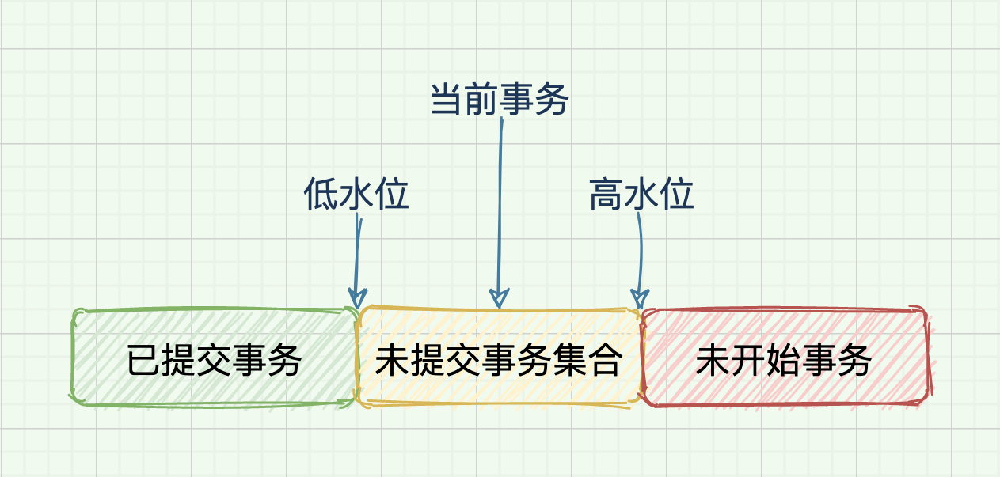

# MySQL 事务

事务是保证一组数据库操作，要么全部成功，要么全部失败。

在 MySQL 中，事务支持在引擎层实现。MySQL 并不是所有的引擎都支持事务。比如 MySQL 原生的 MyISAM 引擎不支持事务，这也是 MyISAM 被 InnoDB 取代的重要原因之一。

ACID（`Atomicity`、`Consistency`、`Isolation`、`Durability`，即原子性、一致性、隔离性、持久性）。

## 隔离级别

通常而言，事务隔离越严格，效率就会越低。因此需要要在二者之间寻找一个平衡点。

### 1. 类型

SQL 标准的事务隔离级别包括以下四种，隔离程度依次递增：

- 读未提交（read uncommitted）

  事务还没提交时，它做的变更就能被别的事务看到。

- 读已提交（read committed）

  事务提交之后，它做的变更才会被其他事务看到。

- 可重复读（repeatable read）

  事务执行过程中看到的数据，总是跟这个事务在启动时看到的数据是一致的。在可重复读隔离级别下，未提交变更对其他事务也是不可见的。

- 串行化（serializable）

  对于同一行记录，“写”会加“写锁”，“读”会加“读锁”。当出现读写锁冲突的时候，后访问的事务必须等前一个事务执行完成，才能继续执行。

**注：MySQL 默认隔离级别为可重复读。**

### 2. 实现方式

- 在可重复读隔离级别下，数据库会在事务启动时创建一个视图，整个事务存在期间以此视图的逻辑结果为准。
- 读提交隔离级别下，这个视图是在每个 SQL 语句开始执行的时候创建的。
- 读未提交隔离级别下直接返回记录上的最新值，没有视图概念。
- 串行化隔离级别下直接用加锁的方式来避免并行访问。

### 3. 可重复读

可重复读的核心就是一致性读（consistent read）。

而事务更新数据的时候，只能用当前读。如果当前的记录的行锁被其他事务占用的话，就需要进入锁等待。

## Undo Log

undo log 就是在修改数据之前，把数据的原值先保存起来（undo log），以便能够回滚数据。

undo log 有两个用处，事务回滚和多版本并发控制（MVCC）。

**注：undo log 做的是逻辑上的数据回滚，存储在单独的表空间中。**

### 1. 类型

`undo log` 有两种类型，分别是 insert undo log 和 update undo log：

- `insert undo log` 记录的是 insert 语句对应的 undo log。

  不涉及 MVCC，事务结束以后就可以删除。

- `update undo log` 记录的是 update、delete 语句对应的 undo log。

  涉及 MVCC，需要保存一定时间。当系统判断，没有比这个 undo log 更早的 read-view 的时候，undo log 会被删除。这是不建议使用长事务的一个原因，会导致大量回滚记录都必须保留，大量占用存储空间。

## MVCC

数据库的多版本并发控制（MVCC），就是同一条记录在系统中可以存在多个版本。

MVCC 只在读提交和可重复读两种隔离级别下工作，另两个隔离级别不兼容。

**MVCC 使得数据库读数据时不会被更新数据的写锁堵住，提高了数据库的并发处理能力**。

### 1. 实现方式

InnoDB 里每个事务有一个唯一的事务 ID: `transaction id`。它是在事务开始的时候向 InnoDB 的事务系统申请的，按申请顺序严格递增。

每行数据也是有多个版本的。每次事务更新数据的时候，都会生成一个新的数据版本，数据版本中存储 `undo log`，并把 `transaction id` 赋值给这个数据版本的 `row trx_id`。同时，旧的数据版本保留，并且在新的数据版本中，能够有信息可以直接拿到它。

也就是说，数据表中的一行记录，可能有多个版本 (row)，每个版本有自己的 `row trx_id`。

每次需要之前版本的数据时，通过回滚 `undo log` 得到之前版本的值。

### 2. 数据版本可见性规则

InnoDB 为每个事务构造了一个数组，用来保存这个事务启动瞬间，当前启动了但还没提交的所有事务 ID。

- 数组里面事务 ID 的最小值记为低水位
- 当前系统里面已经创建过的事务 ID 的最大值加 1 记为高水位

这个视图数组和高水位，组成了当前事务的一致性视图（read-view）。

而数据版本的可见性规则，就是基于数据的 row trx_id 和这个一致性视图的对比结果得到。

- 如果落在绿色部分，表示这个版本是已提交的事务或者是当前事务自己生成的，是可见的。
- 如果落在红色部分，表示这个版本是由将来启动的事务生成的，是肯定不可见的。
- 如果落在黄色部分，包括两种情况：
  1. 若 `row trx_id` 在数组中，表示这个版本是由还没提交的事务生成的，不可见。
  2. 若 `row trx_id` 不在数组中，表示这个版本是已经提交了的事务生成的，可见。

### 3. 数据更新

MVCC 只能解决数据更新时不影响读取，而如果要更新数据时，数据更新的逻辑则不能再使用 MVCC 版本控制，只能使用读锁进行阻塞。

**更新数据都是先读后写的，而这个读，只能读当前的值，称为当前读（current read）。**

除了 update 语句外，select 语句如果加锁，也是当前读。

## 可能出现的问题

### 1. 脏读

脏读 (Dirty Read) 是一个事务读到了另一个未提交事务修改过的数据。

脏读只在读未提交隔离级别才会出现。

### 2. 不可重复读

不可重复读指在同一个事务中，同一条数据，查询到的数据内容不同。

不可重复读在读未提交和读已提交两个级别中可能出现。

### 3. 幻读

幻读是指在同一个事务中，同样的查询语句执行多次，得到了不同的结果集。

除了串行化隔离级别，其他隔离级别都有可能出现幻读问题。

MySQL 主要使用 MVCC 和间隙锁两种方式解决幻读问题。

- **MVCC：**

  由于 MVCC 机制，快照中的普通读取使用的是快照读，只能读取到快照，解决了普通读的幻读问题。

- **间隙锁：**

  事务中的更新数据操作都是使用的当前读，如果其他事务在此期间插入了新数据，而读锁又锁不住加锁之后新插入的数据，就会出现幻读问题。查询行为如果加锁，也会变成当前读，也会出现幻读问题。

  间隙锁将读取行为扫描到的所有数据的间隙间和行上锁，使其他事务无法在这个范围内插入新数据，由此解决了幻读问题。

