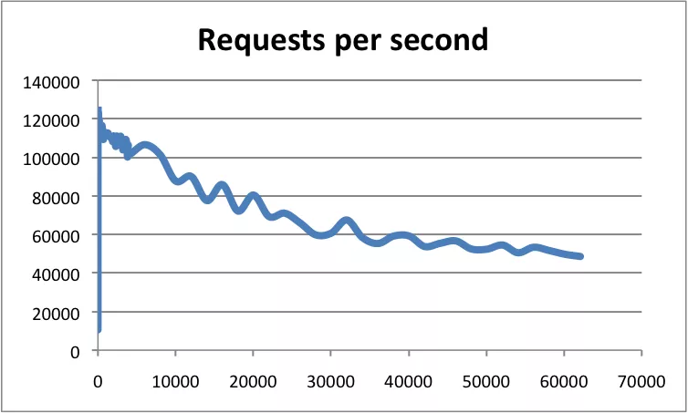

# Redis 整体架构

## 性能

根据官方数据，Redis 的 QPS 可以达到约 100000。使用 pipeline 批处理甚至可以达到 100W+。



- 横轴是连接数
- 纵轴是 QPS

### 1. 测试性能

运行以下命令可以测试同时执行 10 万个请求时的性能：

```sh
$ redis-benchmark -n 100000 -q
```

### 2. 高性能原因

- `纯内存 I/O`

  相较于其他基于磁盘的 DB，Redis 的纯内存操作有着天然的性能优势。

- `I/O 多路复用`

  基于 `epoll/select/kqueue` 等 I/O 多路复用技术，实现高吞吐的网络 I/O。

- `单线程模型`

  保证了每个操作的原子性，避免了多线程频繁上下文切换，以及同步机制如锁带来的开销。

- `高效的数据结构`

  - 全局哈希表，时间复杂度为 $O(1)$。
  - 根据实际存储的数据类型选择底层不同的数据结构，优化了读写速度。

## 整体架构

首先需要明确的一点是，常说 Redis 是单线程，指的是 Redis 的数据主处理程序为单线程，在较高版本里，部分命令和网络 IO 部分已被更改为多线程执行：

1. Redis v4.0（引入多线程处理异步任务）
2. Redis v6.0（正式在网络模型中实现 I/O 多线程）

### 1. 架构

### 2. 使用单线程原因

**官方回答：**

> It's not very frequent that CPU becomes your bottleneck with Redis, as usually Redis is either memory or network bound. For instance, using pipelining Redis running on an average Linux system can deliver even 1 million requests per second, so if your application mainly uses O(N) or O(log(N)) commands, it is hardly going to use too much CPU.

对于 Redis 这种完全的纯内存的操作来说，执行速度非常快，CPU 通常不会是性能瓶颈，因为大多数请求不是 CPU 密集型任务，而是 I/O 密集型。

Redis 真正的性能瓶颈在于网络 I/O，也就是客户端和服务端之间的网络传输延迟，因此 Redis 选择了单线程的 I/O 多路复用来实现它的核心网络模型。

**具体原因：**

- `避免过多的上下文切换开销`

  多线程调度过程中需要在 CPU 之间切换线程上下文 context，上下文的切换又涉及程序计数器、堆栈指针和程序状态字等一系列的寄存器置换、程序堆栈重置甚至是 CPU 高速缓存、TLB 快表的汰换。

  单一进程内多线程共享进程地址空间，因此线程上下文比之进程上下文要小得多，如果是跨进程调度，则需要切换掉整个进程地址空间。

  如果是单线程则可以规避进程内频繁的线程切换开销，因为程序始终运行在进程中单个线程内。

- `避免同步机制的开销`

  如果 Redis 选择多线程模型，那么势必涉及到底层数据同步的问题，则必然会引入某些同步机制，比如锁。

  Redis 不仅提供了简单的 key-value 数据结构，还有 list、set 和 hash 等等其他丰富的数据结构，而不同的数据结构对同步访问的加锁粒度又不尽相同，可能会导致在操作数据过程中带来很多加锁解锁的开销，增加程序复杂度的同时还会降低性能。

- `简单可维护`

  简单可维护性必然是 Redis 早期的核心准则之一，而引入多线程必然会导致代码的复杂度上升和可维护性下降。

### 3. 多线程异步操作

在 Redis v4.0 中，Redis 添加了一些多线程异步执行的命令。此举主要针对的是那些非常耗时的命令，通过将这些命令的执行进行异步化，避免阻塞单线程的事件循环。

比如 `DEL` 命令是用来删除掉一个或多个 key 储存的值，大多数情况下要删除的 key 并不大，所以可以很快执行完，但是如果你要删的是一个超大的键值对，里面有几百万个对象，那么这条命令可能会阻塞至少好几秒，又因为事件循环是单线程的，所以会阻塞后面的其他事件，导致 Redis 吞吐量下降。

于是，在 Redis v4.0 之后增加了一些非阻塞命令如 `UNLINK`、`FLUSHALL ASYNC`、`FLUSHDB ASYNC`。

`UNLINK` 命令是 `DEL` 的异步版本，它不会同步删除数据，而只是把 key 从 keyspace 中暂时移除掉，然后将任务添加到一个异步队列，最后由后台线程去删除。不过如果用 `UNLINK` 去删除一个很小的 key，用异步的方式反而开销更大，所以它会先计算一个开销的阈值，只有当这个值大于 64 才会使用异步的方式去删除 key，对于基本的数据类型如 List、Set、Hash，阈值就是其中存储的对象数量。

除此之外，在 Redis v4.0 中，Redis 主线程启动后，会创建三个子线程来负责 AOF 日志写操作、键值对删除以及关闭文件描述符的异步执行。

### 4. I/O 多路复用

Redis 内部实现了一个高性能的事件库：`AE`，基于 epoll/select/kqueue/evport 四种事件驱动技术，实现 Linux/MacOS/FreeBSD/Solaris 多平台的高性能事件循环模型。

Redis 的核心网络模型正式构筑在 AE 之上，包括 I/O 多路复用、各类处理器的注册绑定，都是基于此才得以运行。

## 多线程网络模型

### 1. Redis 单线程模型

从 Redis 的 v1.0 到 v6.0 版本之前，Redis 的核心网络模型一直是一个典型的单 `Reactor` 模型：利用 epoll/select/kqueue 等多路复用技术，在单线程的事件循环中不断去处理事件（客户端请求），最后回写响应数据到客户端。


- `client`

  客户端对象，Redis 是典型的 CS 架构，客户端通过 socket 与服务端建立网络通道然后发送请求命令，服务端执行请求的命令并回复。

  Redis 使用结构体 client 存储客户端的所有相关信息，包括但不限于：

  - 封装的套接字连接 *conn
  - 当前选择的数据库指针 *db
  - 读入缓冲区 querybuf
  - 写出缓冲区 buf
  - 写出数据链表 reply

- `aeApiPoll`

  I/O 多路复用 API，是基于 epoll_wait/select/kevent 等系统调用的封装，监听等待读写事件触发，然后处理，它是事件循环（Event Loop）中的核心函数，是事件驱动得以运行的基础。

- `acceptTcpHandler`

  连接应答处理器，底层使用系统调用 accept 接受来自客户端的新连接，并为新连接注册绑定命令读取处理器，以备后续处理新的客户端 TCP 连接；除了这个处理器，还有对应的 acceptUnixHandler 负责处理 Unix Domain Socket 以及 acceptTLSHandler 负责处理 TLS 加密连接。

- `readQueryFromClient`

  命令读取处理器，解析并执行客户端的请求命令。
  beforeSleep：事件循环中进入 aeApiPoll 等待事件到来之前会执行的函数，其中包含一些日常的任务，比如把 client->buf 或者 client->reply （后面会解释为什么这里需要两个缓冲区）中的响应写回到客户端，持久化 AOF 缓冲区的数据到磁盘等，相对应的还有一个 afterSleep 函数，在 aeApiPoll 之后执行。

- `sendReplyToClient`

  命令回复处理器，当一次事件循环之后写出缓冲区中还有数据残留，则这个处理器会被注册绑定到相应的连接上，等连接触发写就绪事件时，它会将写出缓冲区剩余的数据回写到客户端。