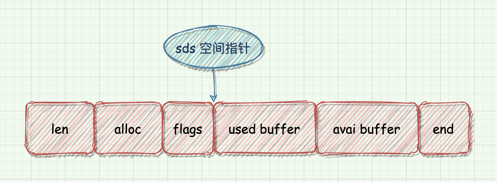
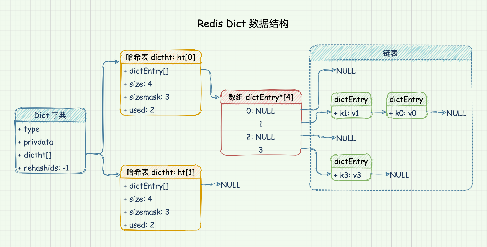
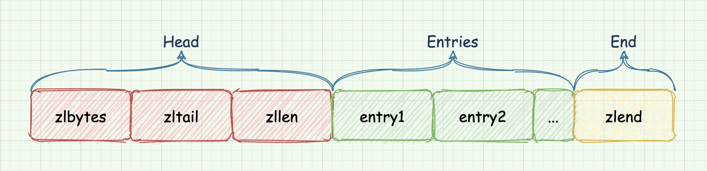

## SDS String

SDS，全称 `Simple Dynamic String`。

在 Redis 中，包含字符串值的键值对都是由 SDS 实现的，而不是 C 语言自带的字符串。SDS 字符串适合用来表示可以被修改的字符串。

**优点：**

- 计算长度的时间复杂度为 O(1)
- 二进制安全
- 减少修改操作的内存重分配次数
- 杜绝缓冲区溢出

**缺点：**

- 占用更多内存，并且这些内存不会被主动释放

### 2. 数据结构

sds 的完整结构分为两块部分，`sdshdr` 结构和字符数组。

- `len` - sds buffer 的已用长度。小于等于 alloc，len 根据类型可以分为无符号的 8 位、16 位、32 位、64 位的整数。

- `alloc` - sds buffer 分配的内存空间的总长度。alloc 根据类型可以分为无符号的 8 位、16 位、32 位、64 位的整数。

- `flags` - sds 的类型。取值范围为 0-4，用来表示 sds 的五种类型：5位、8 位、16 位、32 位、64 位，其中 0 表示的 5 位类型实际上并没有用到。

  类型根据 buffer 的总长度来决定，比如 8 位类型，buffer 的最大长度为 255。

  当表示 5 位的 `sdshdr5` 时，前三位用于表示类型，后五位用于存储字符串内容，此时没有 `buf[]` 部分。

- `buf[]` - 字符数组，实际存储字符串的地方。buffer 由三部分组成：`used buffer`、`avai buffer`、`end`。

  - `used buffer` - 已经使用的 buffer。长度由 len 表示。

  - `avai buffer` - 剩余可用的 buffer。长度等于 alloc - len。

  - `end` - 表示 buffer 的结尾。占用 8 位空间，等同于 `/0`。

注：Redis 3.2 以前，SDS 使用 len 和 free 两个 4 字节的参数来表示字符串的大小。Redis 3.2 之后，SDS 字符串按长度划分成 5 种不同的类型，增加了一个 1 字节大小的 flags 字段表示类型，这样在存储短字符串时，len 和 alloc 可以被缩短到 1 字节。这是 Redis 节省内存的设计。

### 3. 扩容与释放

SDS 的空间预分配策略：

1. 若 SDS 中剩余空闲长度 avail 大于或等于新增内容的长度 addlen，无需扩容。
2. 若 SDS 中剩余空闲长度 avail 小于或等于 addlen，则分情况讨论：
   - 新增后总长度 `len+addlen < 1MB` 的，按新长度的 2 倍扩容
   - 新增后总长度 `len+addlen >= 1MB` 的，按新长度加上 `1MB` 扩容。

SDS 的惰性释放策略：

1. 当 SDS 的长度缩短时，Redis 并不会立即回收不再使用的内存空间，而是更新 len 属性，需要时使用 `alloc-le`n 即可获知未被使用的空间大小。
2. 目的是避免频繁的内存分配，但会造成部分内存的浪费。
3. Redis 也提供了主动释放未使用内存的方法。

## HashTable

Redis 的 HashTable 使用 `MurmurHash2` 算法计算 Hash 值。

**优点：**

- 访问数据的时间复杂度为 O(1)

**缺点：**

- 有哈希冲突问题

### 1. 链表法

Redis 中的 HashTable 使用链表法解决 Hash 冲突问题。**也就是同一个桶里面的元素使用链表保存**。

但是当链表过长就会导致查找性能变差可能，所以 Redis 的字典都使用了两个 HashTable 用于 Rehash 操作，增加现有的哈希桶数量，减少哈希冲突。

一般情况下，字典只使用 `ht[0]` HashTable, `ht[1]` HashTable 只在进行 Rehash 时使用。

### 2. 负载因子

负载因子用于衡量 HashTable 的“健康状况”。

> HashTable 的负载因子 = 填入 HashTable 中的元素个数 / HashTable 的长度

对于 HashTable 来说，负载因子过大或过小都不好，

- 负载因子过大，代表空闲位置越少，冲突也就越多，散列表的性能会下降
- 负载因子过小，则会造成内存不能合理利用，从而形成内存浪费

因此我们为了保证负载因子维持在一个合理的范围内，要对散列表的大小进行收缩或扩展，即 `Rehash`，类似于数组的收缩与扩容。

### 3. Rehash

**Rehash 执行条件**

在满足以下条件之一时，将进行 Rehash 操作：

- 负载因子大于等于 1 且 `dict_can_resize` 设置为 1，执行扩容操作
- 负载因子小于 `0.1`，执行收缩操作

当服务正在执行 `BGSAVE` 命令或者 `BGREWRITEAOF` 命令进行持久化操作时，Redis 不会进行 Rehash 操作，除非满足以下条件：

- 负载因子大于等于安全阈值 `dict_force_resize_ratio`，默认为 5 时，将无视持久化操作，强制执行 Rehash 扩容操作

**Rehash 过程**

扩展 HashTable 和收缩 HashTable 都是通过执行 Rehash 来完成，主要经过以下五步：

1. 为 `ht[1]` 分配空间，其大小取决于 `ht[0]` 已使用节点数，即 `ht[0].used`

   - 扩展操作，`ht[1]` 的大小为第一个大于等于 `ht[0].used * 2` 的 $2^n$

     如：`ht[0].used=3` 则 `ht[1]` 的大小为 8，`ht[0].used=5` 则 `ht[1]` 的大小为 16

   - 收缩操作， `ht[1]` 的大小为第一个大于等于 `ht[0].used` 的 $2^n$​

2. 将字典的 `rehashidx` 设置为 0，表示正在执行 rehash 操作
3. 将 `ht[0]` 中所有的键值对依次重新计算哈希值，并放到 `ht[1]` 数组对应位置，完成一个键值对的 Rehash 之后`rehashidx` 的值加 1
4. 当 `ht[0]` 中所有的键值对都迁移到 `ht[1]` 之后，释放 `ht[0]`，将 `ht[1]` 修改为 `ht[0]`，然后再创建一个新的 `ht[1]` ，为下一次 Rehash 做准备。
5. 将字典的 `rehashidx` 设置为 -1，表示 rehash 已经结束

### 4. 渐进式 Rehash

由于 Rehash 过程需要完全重新计算整个 HashTable 的所有数据，需要的计算量非常庞大，所以 Redis 将 Rehash 过程分成多步进行，这被称为渐进式 Rehash。

渐进式 Rehash 以 bucket 为单位进行数据迁移：

- Redis 执行每一个增删查改命令时都会检测是否处于 Rehash 过程中，如果是则帮助执行一次渐进式 Rehash 的数据迁移
- 同时，Redis 的周期函数如果发现有字典处于 Rehash 过程中，也会帮助执行一次渐进式 Rehash 的数据迁移，此行为需要配置 `activerehashing`，默认值为 1

在渐进式 Rehash 的过程中，会同时使用两个 HashTable

- Delete、Find、Update 操作会优先从 `ht[0]` 查找，如果找不到再从 `ht[1]` 查找
- 而插入操作则只会插入到 `ht[1]` 中

这就保证了随着 Rehash 过程的进行，`ht[0]` 的数据只减不增，最终变成一张空表。

## ZipList

压缩数组 `ziplist` 是为了节省内存而开发的一种数据结构，由一系列特殊编码的连续内存块组成的顺序型数据结构。

`ziplist` 不存储指向上一个节点和下一个节点的指针，存储的是上一个节点的长度和当前节点的长度，牺牲了部分读写性能来换取高效的内存利用率，是一种时间换空间的思想。

**优点：**

- 使用更加紧凑的结构实现多个元素的连续存储，在节省内存方面比 HashTable 更加优秀

**缺点：**

- 每次增删数据都会引发一次内存的 realloc，存储数据量大时 realloc 可能会导致大量的数据拷贝。只适用于字段个数少和字段值少的场景
- 连锁更新问题

### 1. 数据结构

- `zlbytes` - uint32_t 4 字节

  记录整个 zaplist 占用内存字节数，包括本身所占用的 4 个字节。在对 ziplist 进行内存重分配，或计算 zlend 位置时使用。

- `zltail` - uint32_t 4 字节

  记录 zaplist 尾节点距离 zaplist 起始地址有多少个字节。通过这个值无需遍历整个 zaplist 就可以计算出尾节点的地址。

- `zllen` - uint16_t 2 字节

  记录 zaplist 中包含的节点数量，当超过可以存储的最大值 65535 时，此值固定为 65535，此时需要遍历整个 zaplist 才能计算出真实节点数。

- `entry` - 列表节点

  存储 zaplist 中的内容，长度由存储的实际数据决定。

- `zlend` - uint8_t 1 字节

  用于标记 zaplist 的末端。

### 2. 节点

zaplist 的节点可以存储两种数据，整数或者字节数组。

`zaplist` 的每个节点分为三部分：

- `previous_entry_length` - 前一个 entry 的长度，以便能够从后到前遍历列表

  1. 如果前一节点的长度小于 254 字节,那么 previous_entry_length 属性的长度为 1 字节，前一节点的长度就保存在这一个字节里面。

  2. 如果前一节点的长度大于等于 254 字节,那么 previous_entry_length 属性的长度为 5 字节。

     其中第一个字节会被设置为 0xFE(十进制值254)，标记后面跟了一个更大的值。

     之后的四个字节则用于保存前一节点的长度。

- `encoding` - 当前 entry 所保存数据的类型以及长度

  1. 当存储的数据是 0-12 范围的小整数时，数据会直接存储到 encoding 中，此时节点将不再会有 content 部分。

- `content` - 具体数据

### 3. 连锁更新

ziplist 不会预留扩展空间，每次插入一个新的元素就需要调用 realloc 扩展内存, 并可能需要将原有内容拷贝到新地址。

每个节点存在 prevlen 属性，用来记录前置节点的长度，根据前置节点长度还分为两种情况，当长度大于等于 254 时，占用空间会从 1 字节扩大到 5 字节。

所谓连锁更新，就是多个长度处于 250 ~ 253 字节之间的连续节点，当一个节点更新后，导致下一个节点 prevlen 由 1 字节变为 5 字节，从而导致下下一个节点 prevlen 值增大，产生连锁反应。

因为连锁更新在最坏情况下需要对压缩列表执行 N 次空间预分配，而每次空间预分配的最坏复杂度为 $O(n)$，所以连锁更新的最坏复杂度为 $O(n^2)$。

不过，虽然连锁更新的复杂度高，但出现的几率较低。

### 3. 时间复杂度

| 操作                                                         | 时间复杂度                                                   |
| :----------------------------------------------------------- | ------------------------------------------------------------ |
| 创建一个新的 zaplist                                         | $O(1)$                                                         |
| 获取给定节点所保存的值                                       | $O(1)$                                                         |
| 返回给定节点的下一个节点                                     | $O(1)$                                                         |
| 返回给定节点的前一个节点                                     | $O(1)$                                                         |
| 返回 zaplist 目前占用的内存字节数                            | $O(1)$                                                         |
| 返回 zaplist 给定索引上的节点                                | $O(n)$                                                         |
| 创建一个包含给定值的新节点,并将这个新节点添加到 zaplist 的表头或者表尾 | 平均 $O(n)$，最坏 $O(n^2)$(可能发生连锁更新)                   |
| 将包含给定值的新节点插人到给定节点之后                       | 平均 $O(n)$，最坏 $O(n^2)$(可能发生连锁更新)                       |
| 从 zaplist 中删除给定的节点                                  | 平均 $O(n)$，最坏 $O(n^2)$(可能发生连锁更新)                       |
| 删除 zaplist 在给定索引上的连续多个                          | 平均 $O(n)$，最坏 $O(n^2)$(可能发生连锁更新)                       |
| 返回 zaplist 目前包含的节点数量                              | 数量小于 65535 时为 $O(1)$，大于 65535 时为 $O(n)$               |
| 在 zaplist 中査找并返回包含了给定值的节点                    | 因为节点的值可能是一个字节数组，所以检查节点值和给定值是否相同的复杂度为 $O(n)$，而查找整个列表的复杂度则为 $O(n^2)$ |

## QuickList

`quicklist` 是 `ziplist` 和 `linkedlist` 的结合体，它使用跟 `linkedlist` 相似的双向链表，每一个链表节点使用 `ziplist` 来紧凑存储数据。

**优点：**

- 节省内存，拥有跟 `ziplist` 几乎相同的空间利用率
- 在大数据量时性能好，插入与弹出性能与 `linkedlist` 相近

**缺点：**

- 实现较为复杂

### 1. 数据结构

- `head`: 指向头节点的指针
- `tail`: 指向尾节点的指针
- `count`: 所有 ziplist entry 的总数量
- `len`: quicklistNode 节点的数量
- `fill`: 单个 quicklistNode 节点中 ziplist 存放 entry 最大总数设置，由 `list-max-ziplist-size` 参数设置，16 bit
- `compress`: 节点压缩深度设置，也就是 quicklist 首尾两端不被压缩的节点的个数，由`list-compress-depth`参数设置，16 bit

### 2. quicklistNode

quicklistNode 是 quicklist 的节点结构。

- `prev`: 指向链表前一个节点的指针
- `next`: 指向链表后一个节点的指针
- `zl`: 数据指针。如果当前节点的数据没有压缩，那么它指向一个 ziplist，否则，它指向一个 quicklistLZF
- `sz`: 表示 zl 指向的 ziplist 的占用字节数总大小，即便 ziplist 被压缩了 sz 的值仍然是压缩前的 ziplist 大小
- `count`: 表示 ziplist 里面包含的 entry 个数
- `encoding`: 表示 ziplist 的编码，1 表示没有压缩，2 表示 LZF 压缩编码
- `container`: 表示一个 quicklist 节点下面是直接存数据，还是使用 ziplist 存数据，或者用其它的结构来存数据。目前的实现中该值是固定为 2，表示使用 ziplist 作为数据容器
- `recompress`: bool 值，为 true 表示数据暂时解压

**quicklistLZF**

List 的设计目标是存放很长的列表数据，当列表很长时占用的内存空间必然会相应增多。但是当列表很长的时候，List 中访问频率最高的是两端的数据，中间的数据访问频率较低。

Redis 会将中间的节点进行压缩，在需要使用时再进行解压缩，进一步减少数据存储的空间。

quicklistLZF 是对 ziplist 利用 `LZF` 算法进行压缩后得到的数据结构：

- `sz`: 表示压缩后的 ziplist 大小
- `compressed`: 是个数组，存放压缩后的 ziplist 字节数组

配置中 `list-compress-depth` 用来配置 quicklist 首尾两端不被压缩的 quicklistNode 节点个数：

- `0` 特殊值，表示所有节点都不压缩
- `1` 表示 quicklist 首尾各有 1 个节点不压缩，中间的节点压缩
- `2` 表示 quicklist 首尾各有 2 个节点不压缩，中间的节点压缩

### 3. 数据操作

- **头部和尾部插入**

  头部插入和尾部插入比较简单，主要分为两种情况：

  1. 如果头节点（或尾节点）ziplist 没有超过限制大小，那么直接插入节点即可。
  2. 如果头节点（或尾节点）ziplist 超过了限制大小，那么新建一个 quicklistNode，将数据插入到新节点中。

- **任意位置插入**

  任意位置插入比较复杂，分为四种情况：

  1. 插入位置 ziplist 没有超过限制大小，那么直接插入节点即可。
  2. 插入位置 ziplist 超过限制大小，但插入位置位于 ziplist 两端，如果相邻节点的 ziplist 没有超过限制大小，那么将数据插入到相邻节点的 ziplist 中。
  3. 插入位置 ziplist 超过限制大小，但插入位置位于 ziplist 两端，如果相邻节点的 ziplist 超过限制大小，此时新建一个 quicklistNode，将数据插入到新节点中。
  4. 插入位置 ziplist 超过限制大小，且插入位置位于 ziplist 中间，那么将当前节点分裂成两个新节点，将数据插入其中一个节点。

- **查找**

  list 的查找操作主要面向 index，每个节点的 ziplist 都有长度属性，根据每个节点的长度找到对应的节点，再根据 ziplist 的 index 找到数据。

- **删除**

  在区间删除时，有以下几个步骤：

  1. 找到 start 所在的 quicklistNode 节点
  2. 计算删除的元素是否小于要删除的 count
  3. 如果不满足删除的个数，则会移动至下一个 quicklistNode 继续删除
  4. 依次循环直到删除完成为止

## IntSet

当集合类型成员都是整数，且数量较少时，Redis 会使用整数集合这种数据结构。

这种数据结构默认情况会使用最小的编码类型存储整数，分配内存。只有当存储了较大的整数时，才会采用更大的编码格式。

**优点：**

- 节省内存

### 1. 数据结构

- `encoding`: 编码方式，默认值是 `INTSET_ENC_INT16`。其值直接影响 contents 数组中元素的数据类型。
- `length`: 整数集合的元素数量，也就是 contents 数组的长度。
- `contents`: 数组，是整数集合的底层实现。数组中的元素按照从小到达的顺序排列，不包括重复项。类型由 encoding 值决定。

### 2. 升级

intset 默认的 encoding 为 `INTSET_ENC_INT16`，只能存储 `-32768 - 32767` 范围内的整数。当存储超出此范围的整数时，则需要升级数据类型，才能添加元素。

升级的步骤如下：

- 根据新元素的类型，扩展整数集合底层数组的空间大小（包括新元素的空间）
- 将底层数组中的所有元素都转换成新元素相同的类型，并将转换后的元素放置到正确的位置上，放置过程（从右至左）中，维持底层数组的有序性
- 将新元素添加到底层数组里边（最末尾）

Intset 让集合可以保存不同长度的整数，又可以确保升级操作只在有需要的时候进行，节省了内存。

**整数集合不支持降级操作**，一旦对数组进行了升级，编码就一直处于升级后的状态。 

### 3. 数据操作

- **查询**
  1. 与第一个元素判断
  2. 与最后一个元素判断
  3. 二分查找
- **插入不需要升级的元素**
  1. 查询新元素的角标位置
  2. 分配空间
  3. 将角标后的数据依次移动位置
  4. 新元素插入角标位置
  5. 修改 set 的 length 属性

### 4. 时间复杂度

| 操作                     | 时间复杂度 |
| ------------------------ | ---------- |
| 创建一个新的整数集合     | $O(1)$       |
| 添加指定元素到集合       | $O(N)$       |
| 移除指定元素             | $O(N)$       |
| 判断指定元素是否在集合中 | $O(logN)$    |
| 随机返回一个元素         | $O(1)$       |
| 取出在指定索引上的元素   | $O(1)$       |
| 返回集合包含的元素个数   | $O(1)$       |
| 返回集合占用的内存字节数 | $O(1)$       |

## SkipList

