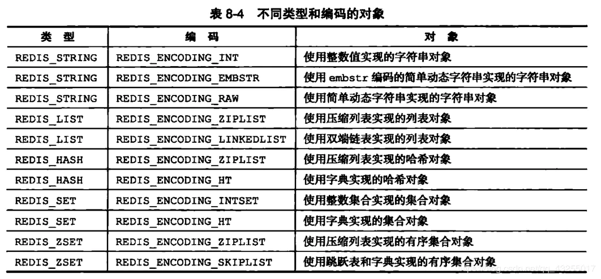

在 Redis 中，常用的 5 种数据类型和应用场景如下：

- `String`：缓存、计数器、限速器、分布式锁等。
- `List`：链表、队列、微博关注人时间轴列表等。
- `Hash`： 用户信息、Hash 表等。
- `Set`： 去重、赞、踩、共同好友等。
- `Zset`：访问量排行榜、点击量排行榜等。

不同数据类型使用不同的数据结构以提升速度。每种数据类型都有一种或者多种数据结构来支撑。


使用以下命令可以查看 Key 具体的编码方式：

```redis
> object encoding key
```

## redisObject

Redis 有一个核心的对象 `redisObject`，用来表示所有的 key。

此对象中有类型和编码两个字段，用来表示 key 的类型和底层数据结构。

