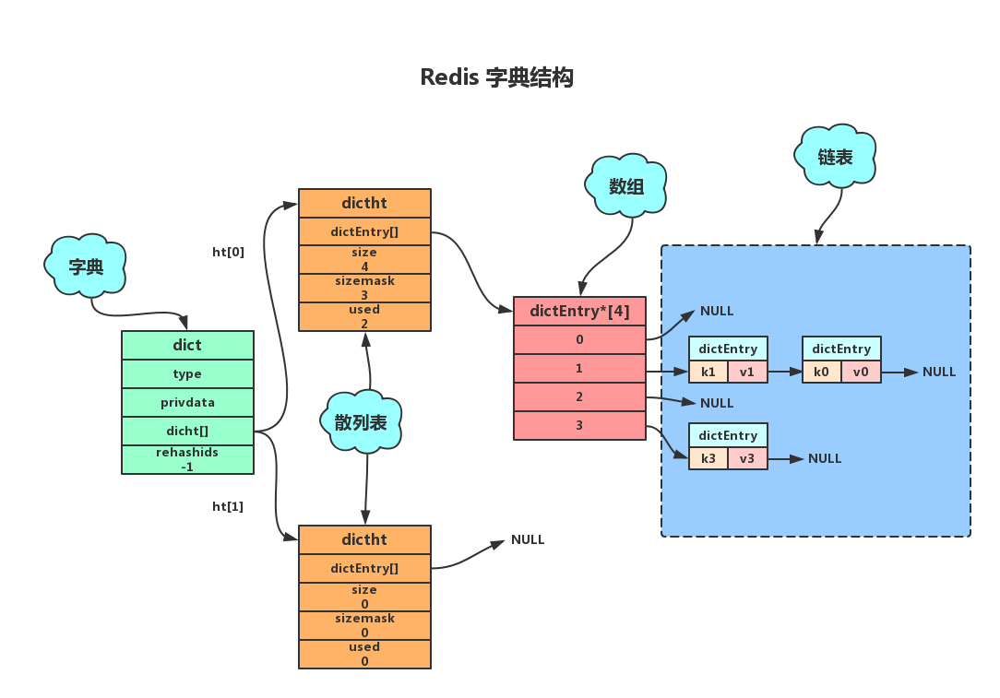
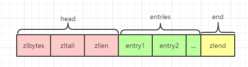

在 Redis 中，常用的 5 种数据类型和应用场景如下：

- `String`：缓存、计数器、分布式锁等。
- `List`：链表、队列、微博关注人时间轴列表等。
- `Hash`： 用户信息、Hash 表等。
- `Set`： 去重、赞、踩、共同好友等。
- `Zset`：访问量排行榜、点击量排行榜等。

不同数据类型使用不同的数据结构以提升速度。每种数据类型都有一种或者多种数据结构来支撑，底层数据结构有 6 种。


使用以下命令可以查看 Key 具体的编码方式：

```redis
> object encoding key
```

## redisObject

Redis 有一个核心的对象 `redisObject`，用来表示所有的 key。

此对象中有类型和编码两个字段，用来表示 key 的类型和底层数据结构。


## SDS String

## HashTable

Redis 的 HashTable 使用 `MurmurHash2` 算法计算 Hash 值。

`HashTable` 类型的数据结构主要应用在三个地方：

- 全局 Hash 表
- Hash 对象，需满足以下两个条件
  1. 当 Hash 对象元素个数大于 `hash-max-ziplist-entries` 配置，默认 512 个
  2. 当有值大于 `hash-max-ziplist-value` 配置，默认 64 字节
- Set 对象

优势：

- 访问数据的时间复杂度为 O(1)

劣势：

- 有哈希冲突问题



### 1. 链表法

Redis 中的 HashTable 使用链表法解决 Hash 冲突问题。**也就是同一个桶里面的元素使用链表保存**。

但是当链表过长就会导致查找性能变差可能，所以 Redis 的字典都使用了两个 HashTable 用于 Rehash 操作，增加现有的哈希桶数量，减少哈希冲突。

一般情况下，字典只使用 `ht[0]` HashTable, `ht[1]` HashTable 只在进行 Rehash 时使用。

### 2. 负载因子

负载因子用于衡量 HashTable 的“健康状况”。

> HashTable 的负载因子 = 填入 HashTable 中的元素个数 / HashTable 的长度

对于 HashTable 来说，负载因子过大或过小都不好，

- 负载因子过大，代表空闲位置越少，冲突也就越多，散列表的性能会下降
- 负载因子过小，则会造成内存不能合理利用，从而形成内存浪费

因此我们为了保证负载因子维持在一个合理的范围内，要对散列表的大小进行收缩或扩展，即 `Rehash`，类似于数组的收缩与扩容。

### 3. Rehash

**Rehash 执行条件**

在满足以下条件之一时，将进行 Rehash 操作：

- 负载因子大于等于 1 且 `dict_can_resize` 设置为 1，执行扩容操作
- 负载因子小于 `0.1`，执行收缩操作

当服务正在执行 `BGSAVE` 命令或者 `BGREWRITEAOF` 命令进行持久化操作时，Redis 不会进行 Rehash 操作，除非满足以下条件：

- 负载因子大于等于安全阈值 `dict_force_resize_ratio`，默认为 5 时，将无视持久化操作，强制执行 Rehash 扩容操作

**Rehash 过程**

扩展 HashTable 和收缩 HashTable 都是通过执行 Rehash 来完成，主要经过以下五步：

1. 为 `ht[1]` 分配空间，其大小取决于 `ht[0]` 已使用节点数，即 `ht[0].used`

   - 扩展操作，`ht[1]` 的大小为第一个大于等于 `ht[0].used * 2` 的 $2^n$

     如：`ht[0].used=3` 则 `ht[1]` 的大小为 8，`ht[0].used=5` 则 `ht[1]` 的大小为 16

   - 收缩操作， `ht[1]` 的大小为第一个大于等于 `ht[0].used` 的 $2^n$​

2. 将字典的 `rehashidx` 设置为 0，表示正在执行 rehash 操作
3. 将 `ht[0]` 中所有的键值对依次重新计算哈希值，并放到 `ht[1]` 数组对应位置，完成一个键值对的 Rehash 之后`rehashidx` 的值加 1
4. 当 `ht[0]` 中所有的键值对都迁移到 `ht[1]` 之后，释放 `ht[0]`，将 `ht[1]` 修改为 `ht[0]`，然后再创建一个新的 `ht[1]` ，为下一次 Rehash 做准备。
5. 将字典的 `rehashidx` 设置为 -1，表示 rehash 已经结束

### 4. 渐进式 Rehash

由于 Rehash 过程需要完全重新计算整个 HashTable 的所有数据，需要的计算量非常庞大，所以 Redis 将 Rehash 过程分成多步进行，这被称为渐进式 Rehash。

渐进式 Rehash 以 bucket 为单位进行数据迁移：

- Redis 执行每一个增删查改命令时都会检测是否处于 Rehash 过程中，如果是则帮助执行一次渐进式 Rehash 的数据迁移
- 同时，Redis 的周期函数如果发现有字典处于 Rehash 过程中，也会帮助执行一次渐进式 Rehash 的数据迁移，此行为需要配置 `activerehashing`，默认值为 1

在渐进式 Rehash 的过程中，会同时使用两个 HashTable

- Delete、Find、Update 操作会优先从 `ht[0]` 查找，如果找不到再从 `ht[1]` 查找
- 而插入操作则只会插入到 `ht[1]` 中

这就保证了随着 Rehash 过程的进行，`ht[0]` 的数据只减不增，最终变成一张空表。

## ZipList

压缩数组 `ziplist` 是为了节省内存而开发的一种数据结构，由一系列特殊编码的连续内存块组成的顺序型数据结构。

`ziplist` 不存储指向上一个节点和下一个节点的指针，存储的是上一个节点的长度和当前节点的长度，牺牲了部分读写性能来换取高效的内存利用率，是一种时间换空间的思想。

`ZipList` 类型的数据结构主要应用在以下位置：

- List
- Hash 对象，需满足以下两个条件
  1. 当 Hash 对象元素个数小于 `hash-max-ziplist-entries` 配置，默认 512 个
  2. 当所有值小于 `hash-max-ziplist-value` 配置，默认 64 字节
- Sorted Set

优势：

- 使用更加紧凑的结构实现多个元素的连续存储，在节省内存方面比 HashTable 更加优秀

劣势：

- 只适用于字段个数少和字段值少的场景
- 连锁更新问题

### 1. 数据结构



- `zlbytes` - uint32_t 4字节

  记录整个 zaplist 占用内存字节数，包括本身所占用的 4 个字节。在对 ziplist 进行内存重分配，或计算 zlend 位置时使用。

- `zltail` - uint32_t 4字节

  记录 zaplist 尾节点距离 zaplist 起始地址有多少个字节。通过这个值无需遍历整个 zaplist 就可以计算出尾节点的地址。

- `zllen` - uint16_t 2字节

  记录 zaplist 中包含的节点数量，当超过可以存储的最大值 65535 时，此值固定为 65535，此时需要遍历整个 zaplist 才能计算出真实节点数。

- `entry` - 列表节点

  存储 zaplist 中的内容，长度由存储的实际数据决定。

- `zlend` - uint8_t 1字节

  用于标记 zaplist 的末端。

### 2. 节点

zaplist 的节点可以存储两种数据，整数或者字节数组。


`zaplist` 的每个节点分为三部分：

- `previous_entry_length` - 前一个 entry 的长度，以便能够从后到前遍历列表

  1. 如果前一节点的长度小于 254 字节,那么 previous_entry_length 属性的长度为 1 字节，前一节点的长度就保存在这一个字节里面。

  2. 如果前一节点的长度大于等于 254 字节,那么 previous_entry_length 属性的长度为 5 字节。

     其中第一个字节会被设置为 0xFE(十进制值254)，标记后面跟了一个更大的值。

     之后的四个字节则用于保存前一节点的长度。

- `encoding` - 当前 entry 所保存数据的类型以及长度

  1. 当存储的数据是 0-12 范围的小整数时，数据会直接存储到 encoding 中，此时节点将不再会有 content 部分。

- `content` - 具体数据

### 3. 时间复杂度

| 操作                                                         | 时间复杂度                                     |
| :----------------------------------------------------------- | ---------------------------------------------- |
| 创建一个新的 zaplist                                         | O(1)                                           |
| 获取给定节点所保存的值                                       | O(1)                                           |
| 返回给定节点的下一个节点                                     | O(1)                                           |
| 返回给定节点的前一个节点                                     | O(1)                                           |
| 返回 zaplist 给定索引上的节点                                | O(N)                                           |
| 返回 zaplist 目前占用的内存字节数                            | O(1)                                           |
| 创建一个包含给定值的新节点,并将这个新节点添加到 zaplist 的表头或者表尾 | 平均O(N)，最坏O(N^2)(可能发生连锁更新)         |
| 将包含给定值的新节点插人到给定节点之后                       | 平均O(N)，最坏O(N^2)(可能发生连锁更新)         |
| 从 zaplist 中删除给定的节点                                  | 平均O(N)，最坏O(N^2)(可能发生连锁更新)         |
| 删除 zaplist 在给定索引上的连续多个                          | 平均O(N)，最坏O(N^2)(可能发生连锁更新)         |
| 返回 zaplist 目前包含的节点数量                              | 数量小于 65535 时为 O(1)，大于 65535 时为 O(N) |
| 在 zaplist 中査找并返回包含了给定值的节点                    | 因为节点的值可能是一个字节数组，所以检查节点值和给定值是否相同的复杂度为O(N)，而查找整个列表的复杂度则为(N^2) |


## IntSet