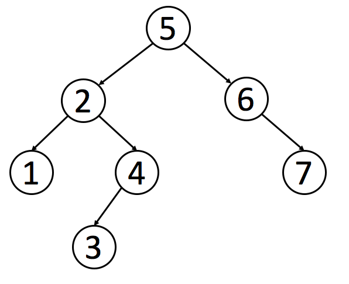

# 二叉搜索树

二叉搜索树 `Binary Search Tree` 简称 `BST`，是二叉树的一种特殊形式。二叉搜索树每个节点 `node` 都具有以下性质：

- 左子树所有子节点的值都比 `node` 的值要小，右子树所有子节点的值都比 `node` 的值大。
- 它的左侧子树和右侧子树都是 BST。

**BST 有一个重要的性质: BST 的中序遍历结果是有序的（升序）**。



## 题解

### 95. 不同的二叉搜索树 II

Leetcode 题目描述: [不同的二叉搜索树 II](https://leetcode-cn.com/problems/unique-binary-search-trees-ii/)

一个整数 `n`，生成并返回所有由 `n` 个节点组成且节点值从 `1` 到 `n` 互不相同的不同二叉搜索树。

可以按任意顺序返回答案。

```go
func generateTrees(n int) []*TreeNode {
	return generate(1, n)
}

func generate(low, high int) []*TreeNode {
	trees := make([]*TreeNode, 0)
	if low > high {
		trees = append(trees, nil)
		return trees
	}

	for i := low; i <= high; i++ {
		leftTrees := generate(low, i-1)
		rightTrees := generate(i+1, high)
		for _, left := range leftTrees {
			for _, right := range rightTrees {
				n := &TreeNode{
					Val:   i,
					Left:  left,
					Right: right,
				}
				trees = append(trees, n)
			}
		}
	}
	return trees
}
```

### 96. 不同的二叉搜索树

Leetcode 题目描述: [不同的二叉搜索树](https://leetcode-cn.com/problems/unique-binary-search-trees/)

给定一个整数 `n`，求由 `n` 个节点组成且节点值从 `1` 到 `n` 互不相同的二叉搜索树有多少种？

```go
var cache [][]int

func numTrees(n int) int {
    cache = make([][]int, n+1)
    for i:=1; i <=n; i++ {
        cache[i] = make([]int, n+1)
    }
    return count(1, n)
}

func count(low, high int) int {
    if low > high {
        return 1
    }

    if cache[low][high] != 0 {
        return cache[low][high]
    }

    var c int
    for i := low; i <= high; i++ {
        left := count(low, i-1)
        right := count(i + 1, high)
        c += left * right
    }
    cache[low][high] = c
    return c
}
```

### 98. 验证二叉搜索树

Leetcode 题目描述: [验证二叉搜索树](https://leetcode-cn.com/problems/validate-binary-search-tree/)

给定一个二叉树，判断其是否是一个有效的二叉搜索树。

```go
func isValidBST(root *TreeNode) bool {
	var validBST func(n, min, max *TreeNode) bool
	validBST = func(n, min, max *TreeNode) bool {
		if n == nil {
			return true
		}

		if min != nil && n.Val <= min.Val {
			return false
		}
		if max != nil && n.Val >= max.Val {
			return false
		}

		return validBST(n.Left, min, n) && validBST(n.Right, n, max)
	}
	return validBST(root, nil, nil)
}
```

### 230. 二叉搜索树中第K小的元素

Leetcode 题目描述: [二叉搜索树中第K小的元素](https://leetcode-cn.com/problems/kth-smallest-element-in-a-bst/)

给定一个二叉搜索树的根节点 `root`，和一个整数 `k`，设计一个算法查找其中第 `k` 个最小元素（从 1 开始计数）。

```go
func kthSmallest(root *TreeNode, k int) int {
	stack := []*TreeNode{}
	for root != nil || len(stack) > 0 {
		if root != nil {
			stack = append(stack, root)
			root = root.Left
		} else {
			node := stack[len(stack)-1]
			stack = stack[:len(stack)-1]
			k--
			if k == 0 {
				return node.Val
			}
			root = node.Right
		}
	}
	return 0
}
```

### 450. 删除二叉搜索树中的节点

Leetcode 题目描述: [删除二叉搜索树中的节点](https://leetcode-cn.com/problems/delete-node-in-a-bst/)

给定一个二叉搜索树的根节点 root 和一个值 key，删除二叉搜索树中的 key 对应的节点，保证二叉搜索树的性质不变。返回二叉搜索树的根节点。

```go
func deleteNode(root *TreeNode, key int) *TreeNode {
	if root == nil {
		return nil
	}

	switch {
	case root.Val == key:
		if root.Left == nil {
			return root.Right
		} else if root.Right == nil {
			return root.Left
		} else {
			m := min(root.Right)
			root.Val = m.Val
			root.Right = deleteNode(root.Right, m.Val)
		}
	case root.Val < key:
		root.Right = deleteNode(root.Right, key)
	case root.Val > key:
		root.Left = deleteNode(root.Left, key)
	}
	return root
}

func min(n *TreeNode) *TreeNode {
	for n.Left != nil {
		n = n.Left
	}
	return n
}
```

### 538. 把二叉搜索树转换为累加树

Leetcode 题目描述: [把二叉搜索树转换为累加树](https://leetcode-cn.com/problems/convert-bst-to-greater-tree/)

给出二叉搜索树的根节点，该树的节点值各不相同，将其转换为累加树（Greater Sum Tree），使每个节点 node 的新值等于原树中大于或等于 node.val 的值之和。

二叉搜索树满足下列约束条件：

- 节点的左子树仅包含键**小于**节点键的节点。
- 节点的右子树仅包含键**大于**节点键的节点。
- 左右子树也必须是二叉搜索树。

```go
func convertBST(root *TreeNode) *TreeNode {
	var sum int
	var bfs func(n *TreeNode)
	bfs = func(n *TreeNode) {
		if n == nil {
			return
		}
		bfs(n.Right)
		sum += n.Val
		n.Val = sum
		bfs(n.Left)
	}
	bfs(root)
	return root
}
```

### 700. 二叉搜索树中的搜索

Leetcode 题目描述: [二叉搜索树中的搜索](https://leetcode-cn.com/problems/search-in-a-binary-search-tree/)

给定二叉搜索树的根节点和一个值，在 BST 中找到节点值等于给定值的节点，返回以该节点为根的子树，如果节点不存在，返回 NULL。

```go
func searchBST(root *TreeNode, val int) *TreeNode {
	var node *TreeNode
	var dfs func(n *TreeNode)
	dfs = func(n *TreeNode) {
		if n == nil {
			return
		}
		switch {
		case val == n.Val:
			node = n
		case val < n.Val:
			dfs(n.Left)
		case val > n.Val:
			dfs(n.Right)
		}
	}
	dfs(root)
	return node
}

```

### 701. 二叉搜索树中的插入操作

Leetcode 题目描述: [二叉搜索树中的插入操作](https://leetcode-cn.com/problems/insert-into-a-binary-search-tree/)

给定二叉搜索树的根节点和要插入树中的值，将值插入二叉搜索树。返回插入后二叉搜索树的根节点。

- 输入的数据和原始二叉搜索树中的任意节点值都不同。

```go
func insertIntoBST(root *TreeNode, val int) *TreeNode {
	var dfs func(n *TreeNode) *TreeNode
	dfs = func(n *TreeNode) *TreeNode {
		if n == nil {
			return &TreeNode{Val: val}
		}
		switch {
		case val < n.Val:
			n.Left = dfs(n.Left)
		case val > n.Val:
			n.Right = dfs(n.Right)
		}
		return n
	}
	return dfs(root)
}
```

