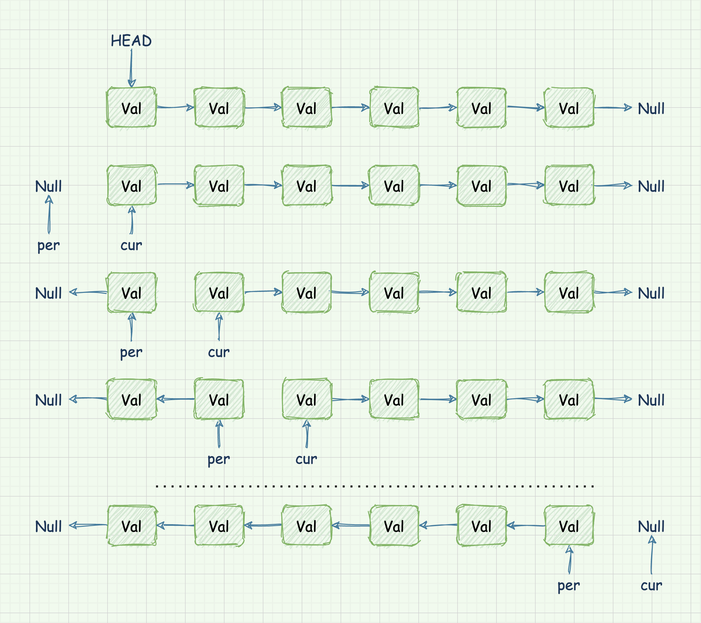
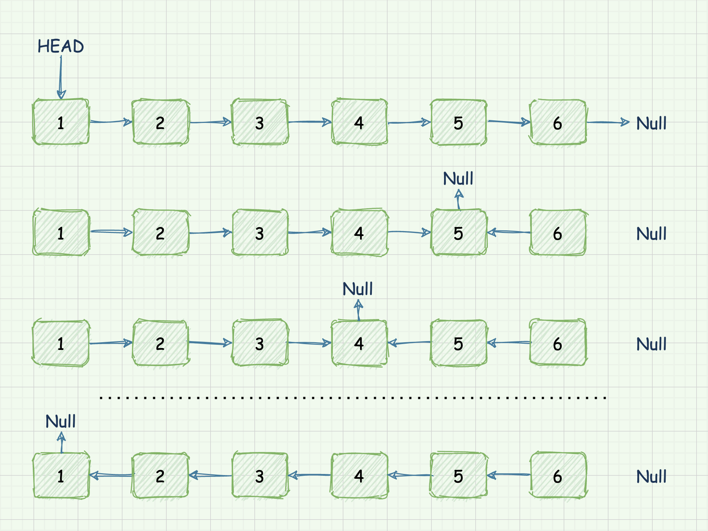

# 链表

常说的链表为单链表，数据结构如下：


Golang 实现：

```go
type ListNode struct {
	Val  int
	Next *ListNode
}
```

## 题解

### 反转链表

输入一个链表的头节点，反转该链表并输出反转后链表的头节点。

示例：

> 输入: 1->2->3->4->5->NULL
> 输出: 5->4->3->2->1->NULL

#### 双指针



1. 定义两个指针：`pre` 和 `cur`，`pre` 指向 `nil`, `cur` 存储 `head` 的值。
2. 每次让 `cur` 的 `next` 指向 `pre` ，实现一次局部指针反转。
3. 局部反转完成之后， `pre = cur` 和 `cur = cur.Next` 使 `pre` 和 `cur` 同时往前移动一个位置。
4. 循环上述过程，直至 `pre` 到达链表尾部，全部指针反转完毕。

```go
func reverseList(head *ListNode) *ListNode {
	var pre, cur *ListNode = nil, head
	for cur != nil {
		cur.Next, pre, cur = pre, cur, cur.Next
	}
	return pre
}
```

#### 递归



1. 递归到链表最尾端 `head.Next.Next == nil` 时，返回节点 `head.Next`，此节点就是反转后的链表头节点。
2. 将 `head.Next.Next` 指向 `head`，使最后一个节点指针反向，指向倒数第二个节点。
3. 将 `head.Next` 指向 nil，借此来存储 nil 值。
4. 依次递归，逐渐使节点指针全部反向，nil 值依次传输到尾节点的 `Next` 中，完成节点反向。

```go
func reverseList(head *ListNode) *ListNode {
    if head == nil || head.Next == nil { // head == nil 判断是避免传入一个无节点空链表时发生异常
        return head
    }

    var newNode *ListNode
    newNode = reverseList(head.Next)
    head.Next.Next = head
    head.Next = nil
    return newNode
}
```

### 反转部分链表

### 两数相加

